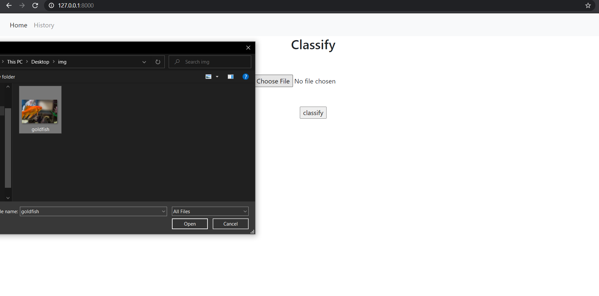

# keras_model_on_Django

Deploying a Keras deep learning model(mobilenet) using Django framework.
Mobilenet was trained on imagenet dataset.
Mobilenet is lightweight in its architecture. It uses depthwise separable convolutions which basically means it performs a single convolution on each colour channel rather than combining all three and flattening it

resources:
[original paper](https://arxiv.org/pdf/1704.04861.pdf)

# Packages
- django
- keras
- tensorflow
- numpy

## Project setup
-Use conda for virtual environment and package management\
-Create the environment from the environment.yml file:\
`conda env create -f environment.yml`\
-Activate the new environment(the first line of the yml file sets the new environment's name.) myenv refers to environment's name: \
`conda activate myenv     `\
-Verify that the new environment was installed correctly:\
`conda env list`\
-You can also use :\
`conda info --envs`

## Snippets

